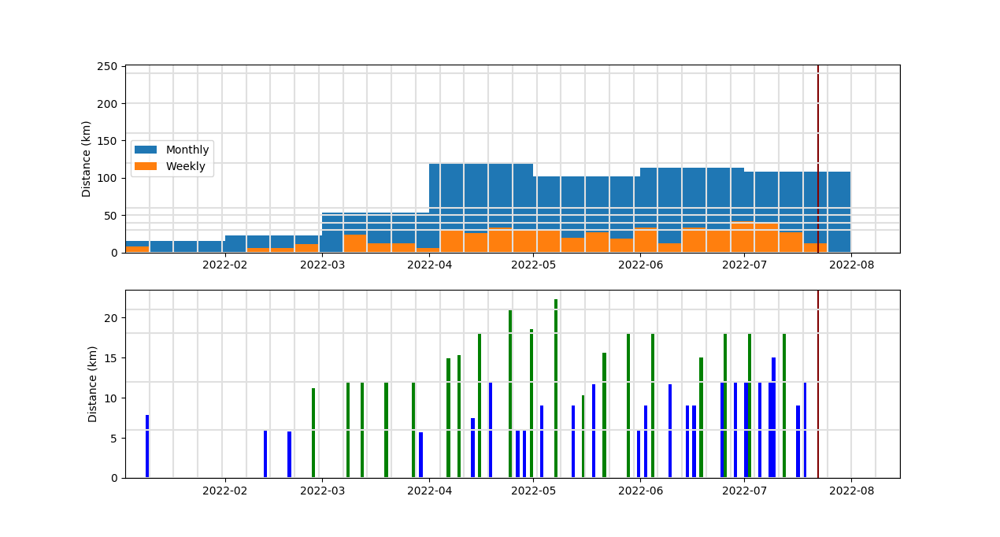
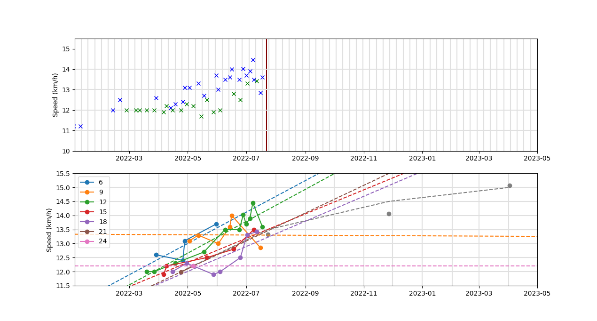

# README.md

## Logging time and distance

**GPS traces**

Android app: OpenGPSTracker

Issues with battery optimizations killing the app.

**Current option**

Measuring the distance with Viking before/afterhands and measure the time with
simple clock.

## Viking (distance and altitude measurements, GPS trace post-processing, ...)

https://github.com/viking-gps/viking

**Initial first-time configuration**

* `Edit`, `Preferences`
    * `Startup`, `Startup method`, `Last location`
* `Edit`, `Layer defaults`, `Map`
    * `Map type`, `OSM (Mapnik)`

**DEM (Digital elevation map)**

* Download DEM files
    * Find the coordinates: https://www.google.fr/maps/@49,2,8z
    * Download the DEM: https://web.archive.org/web/2017*/https://dds.cr.usgs.gov/srtm/version2_1/SRTM3/Eurasia/N49E002.hgt.zip
    * N48W004.hgt - Lannion
    * N48E002.hgt - Paris
    * N49E002.hgt - Paris-Nord
    * N52E013.hgt - Berlin
* In viking
    * `Layer`, `New DEM layer`
    * `Add`

**Trackpoint editing**

* Click `Tool`, `Edit trackpoint`

## Quickstart

```bash
python3 go-plot.py
```




