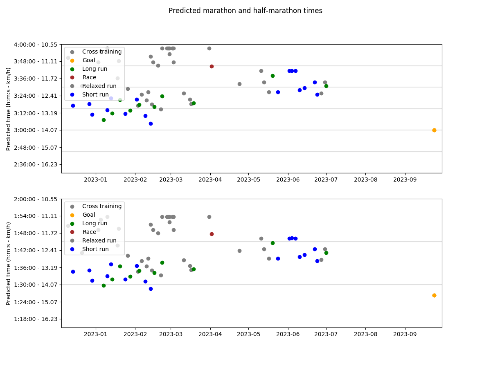
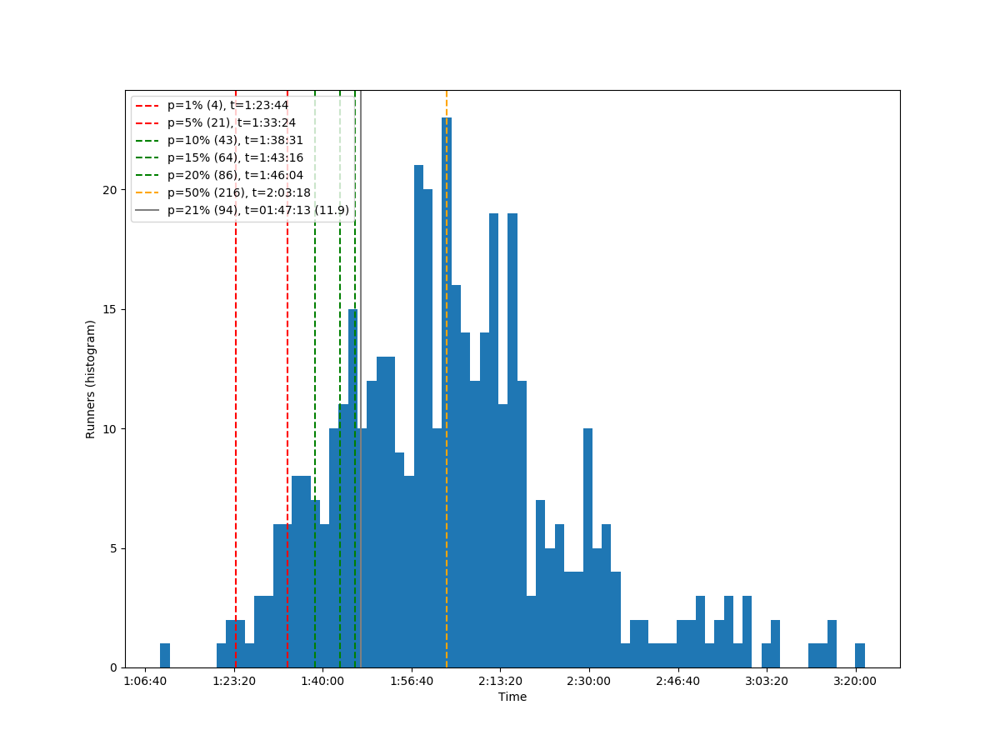

# README.md

This repo contains (a subset) of the data used as part of my running activity.
Bold items might be the most interesting.

* **`build/`: precompiled diagrams.**
* `lockscreen/`: phone lockscreen backgrounds with distance-time checkpoints.
* **`race-results/`: results of past races in which I participated.
    Used to study my performance compared to others.**
* `race-traces/`: GPS traces and pdf/jpg maps of races in which I participated .
* **`training-analysis/`: training performance logs, with analysis and plotting scripts.
        Used to track my performance progression.**
* `training-traces/`: GPS traces of my training routes.
    I use traces with known lengths to make performance comparison easier.
* `viking-DEM/`: DEM (Digital Elevation Map) for the GPX editing software Viking.

## Quickstart

### Training analysis

*Note: cf [training-analysis/README.md](training-analysis/README.md) to see all the graphs.*

Generate several graphs with different information about my training and race
performances, such as total distance, speed, etc.

```bash
python3 training-analysis/main.py
```




### Races results

*Note: cf [race-results/README.md](race-results/README.md) to see all the graphs.*

Generate graphs to study achieved performances in races.
Data has to be preprocessed to convert it to the correct format.

```bash
python3 race-results/plot.py race-results/2022-04-24-Spreewald-21.1km/
```




### Lockscreen

*Note: cf [lockscreen/README.md](lockscreen/README.me) to see all the graphs.*

Generate backgrounds for my phone to keep a plan at hand.
this plan consists of a list of distance-time checkpoints.

```bash
python3 lockscreen/main.py lockscreen/config/race-2022-10-23-Mueggelsee.py
```


## Logging time and distance

**GPS traces**

Android app: OpenGPSTracker

Issues with battery optimizations killing the app.

**Current option**

Measuring the distance with Viking before/afterhands and measure the time with
simple clock.

## Planning and post-processing - Viking (distance and altitude measurements, GPS trace post-processing, ...)

https://github.com/viking-gps/viking

**Initial first-time configuration**

* `Edit`, `Preferences`
    * `Startup`, `Startup method`, `Last location`
* `Edit`, `Layer defaults`, `Map`
    * `Map type`, `OSM (Mapnik)`

**DEM (Digital Elevation Map)**

* Download DEM files
    * Find the coordinates: https://www.google.fr/maps/@49,2,8z
    * Download the DEM: https://web.archive.org/web/2017*/https://dds.cr.usgs.gov/srtm/version2_1/SRTM3/Eurasia/N49E002.hgt.zip
    * N48W004.hgt - Lannion
    * N48E002.hgt - Paris
    * N49E002.hgt - Paris-Nord
    * N52E013.hgt - Berlin
* In viking
    * `Layer`, `New DEM layer`
    * `Add`

**Trackpoint editing**

* Click `Tool`, `Edit trackpoint`
