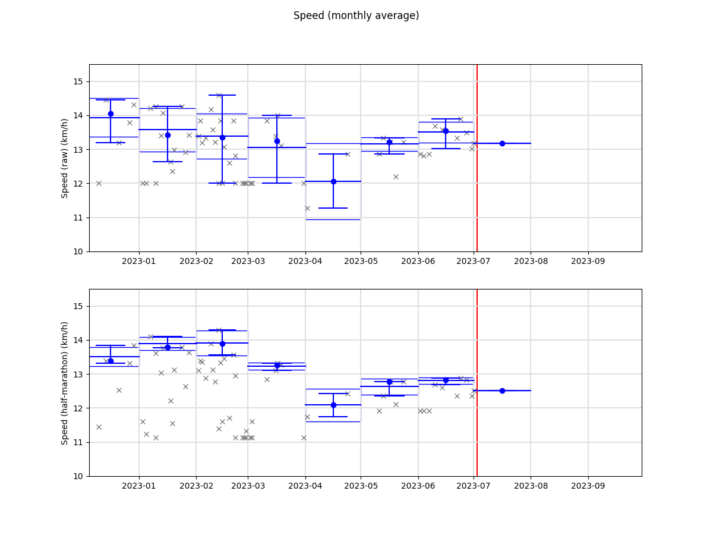

# README.md

This repo contains (a subset) of the data used as part of my running activity:

* Python files: training performance logs, with analysis and plotting scripts.
    Used to track my performance progression.
* `race-results/`: results of past races in which I have participated.
    Used to study my performance compared to others.
* `training-traces/`: GPS traces where I train.
    I use traces with known length to make performance comparison easier.
* `viking-DEM/`: DEM (Digital Elevation Map).

## Logging time and distance

**GPS traces**

Android app: OpenGPSTracker

Issues with battery optimizations killing the app.

**Current option**

Measuring the distance with Viking before/afterhands and measure the time with
simple clock.

## Planning and post-processing - Viking (distance and altitude measurements, GPS trace post-processing, ...)

https://github.com/viking-gps/viking

**Initial first-time configuration**

* `Edit`, `Preferences`
    * `Startup`, `Startup method`, `Last location`
* `Edit`, `Layer defaults`, `Map`
    * `Map type`, `OSM (Mapnik)`

**DEM (Digital Elevation Map)**

* Download DEM files
    * Find the coordinates: https://www.google.fr/maps/@49,2,8z
    * Download the DEM: https://web.archive.org/web/2017*/https://dds.cr.usgs.gov/srtm/version2_1/SRTM3/Eurasia/N49E002.hgt.zip
    * N48W004.hgt - Lannion
    * N48E002.hgt - Paris
    * N49E002.hgt - Paris-Nord
    * N52E013.hgt - Berlin
* In viking
    * `Layer`, `New DEM layer`
    * `Add`

**Trackpoint editing**

* Click `Tool`, `Edit trackpoint`

## Quickstart

### Trainings

```bash
python3 main.py
```

**Milage**

1. All trainings and races distances
2. Distances by week and by month


**Speed**

1. All trainings and races speeds
2. Speeds by distance, with a linear regression


**Average speed**



**Temperature**


**Predicted marathon and half-marathon times**


### Races summary

**Achieved and anticipated performances**

| Date       | Speed | Result        | Race            |
|------------|-------|---------------|-----------------|
| 2022-04-24 | 12.0  | 21% (94/436)  | Spreewald 21.1  |
| 2022-07-24 | 13.5  | 12% (95/767)  | 20 km CDGR 20   |
|            |       |               |                 |
| 2022-10-23 | 14.5  | 4% (40/1000)  | Mueggelsee 21.1 |
| 2022-11-27 | 15.0  | 7% (0.5k/8k)  | Boulogne 21.1   |
| 2023-04-02 | 14.0  | 5% (1.7k/34k) | Paris 42.2      |
| 2023-04-30 | 14.0  | 2% (5/200)    | Spreewald 42.2  |
| 2023-07-23 | 15.0  | 4% (30/767)   | 20 km CDGR 20   |

### Races details

Runners performances with various percentiles and my own performance.

**2022-04-24 - Spreewald - 21.1 km**

```bash
python3 race-results/plot.py race-results/2022-04-24-Spreewald-21.1km/
```


**2022-07-24 - 20 km CDGR - 20 km**

```bash
python3 race-results/plot.py race-results/2022-07-24-20km-CDGR-20km/
```


