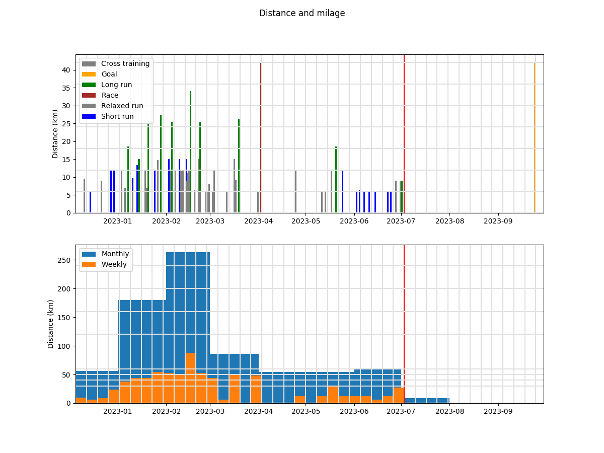
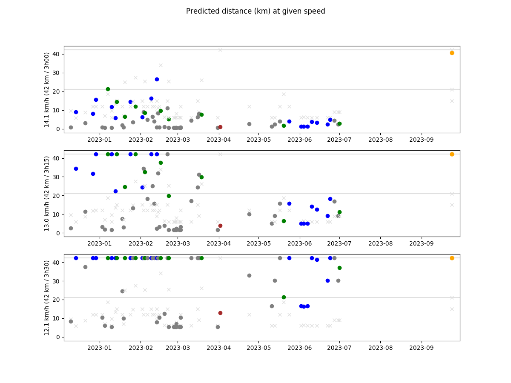

# README.md

This repo contains (a subset) of the data used as part of my running activity:

* Python files: training performance logs, with analysis and plotting scripts.
    Used to track my performance progression.
* `race-results/`: results of past races in which I have participated.
    Used to study my performance compared to others.
* `training-traces/`: GPS traces where I train.
    I use traces with known length to make performance comparison easier.
* `viking-DEM/`: DEM (Digital Elevation Map).

## Logging time and distance

**GPS traces**

Android app: OpenGPSTracker

Issues with battery optimizations killing the app.

**Current option**

Measuring the distance with Viking before/afterhands and measure the time with
simple clock.

## Planning and post-processing - Viking (distance and altitude measurements, GPS trace post-processing, ...)

https://github.com/viking-gps/viking

**Initial first-time configuration**

* `Edit`, `Preferences`
    * `Startup`, `Startup method`, `Last location`
* `Edit`, `Layer defaults`, `Map`
    * `Map type`, `OSM (Mapnik)`

**DEM (Digital Elevation Map)**

* Download DEM files
    * Find the coordinates: https://www.google.fr/maps/@49,2,8z
    * Download the DEM: https://web.archive.org/web/2017*/https://dds.cr.usgs.gov/srtm/version2_1/SRTM3/Eurasia/N49E002.hgt.zip
    * N48W004.hgt - Lannion
    * N48E002.hgt - Paris
    * N49E002.hgt - Paris-Nord
    * N52E013.hgt - Berlin
* In viking
    * `Layer`, `New DEM layer`
    * `Add`

**Trackpoint editing**

* Click `Tool`, `Edit trackpoint`

## Quickstart

### Trainings

```bash
python3 main.py
```

**Distance and milage**

1. All trainings and races distances
2. Distances by week and by month



**Speed (progression)**

1. All trainings and races speeds
2. Speeds by distance, with a linear regression


**Speed (monthly average)**


**Predicted marathon and half-marathon times**


**Predicted distance (km) at 14.1 km/h**



**Stdout**

```
== Milage (yearly) ==
2020-01-01:  6 runs -   32 km /  3.0 h - avg/run:  5.9 km, 11.27 km/h - predicted: 10.74/10.31 km/h
2021-01-01: 27 runs -  223 km / 19.4 h - avg/run:  8.5 km, 11.72 km/h - predicted: 11.92/11.44 km/h
2022-01-01: 73 runs -  953 km / 72.8 h - avg/run: 13.2 km, 13.20 km/h - predicted: 13.99/13.42 km/h

== Milage (monthly) ==
2022-01-01:  2 runs -   15 km /  1.4 h - avg/run:  7.8 km, 11.14 km/h - predicted: 10.50/10.07 km/h
2022-02-01:  3 runs -   23 km /  1.9 h - avg/run:  7.7 km, 12.37 km/h - predicted: 11.76/11.28 km/h
2022-03-01:  5 runs -   53 km /  4.5 h - avg/run: 12.0 km, 12.17 km/h - predicted: 11.60/11.13 km/h
2022-04-01:  9 runs -  119 km /  9.8 h - avg/run: 14.2 km, 12.35 km/h - predicted: 12.14/11.64 km/h
2022-05-01:  8 runs -  101 km /  8.2 h - avg/run: 13.7 km, 12.84 km/h - predicted: 12.67/12.15 km/h
2022-06-01:  9 runs -  113 km /  8.8 h - avg/run: 13.1 km, 13.32 km/h - predicted: 13.19/12.66 km/h
2022-07-01: 12 runs -  149 km / 10.9 h - avg/run: 13.0 km, 13.80 km/h - predicted: 13.52/12.97 km/h
2022-08-01: 12 runs -  163 km / 11.9 h - avg/run: 14.3 km, 13.85 km/h - predicted: 13.62/13.06 km/h
2022-09-01: 10 runs -  163 km / 11.9 h - avg/run: 17.1 km, 13.92 km/h - predicted: 13.91/13.34 km/h
2022-10-01:  3 runs -   51 km /  3.6 h - avg/run: 17.0 km, 14.04 km/h - predicted: 13.92/13.35 km/h

== Milage (weekly) ==
2022-01-03:  1 runs -    7 km /  0.7 h - avg/run:  7.8 km, 11.14 km/h - predicted: 10.50/10.07 km/h
2022-01-10:  0 runs -    0 km /  0.0 h - avg/run:  0.0 km,  0.00 km/h - predicted:  0.00/ 0.00 km/h
2022-01-17:  0 runs -    0 km /  0.0 h - avg/run:  0.0 km,  0.00 km/h - predicted:  0.00/ 0.00 km/h
2022-01-24:  0 runs -    0 km /  0.0 h - avg/run:  0.0 km,  0.00 km/h - predicted:  0.00/ 0.00 km/h
2022-01-31:  0 runs -    0 km /  0.0 h - avg/run:  0.0 km,  0.00 km/h - predicted:  0.00/ 0.00 km/h
2022-02-07:  1 runs -    6 km /  0.5 h - avg/run:  6.0 km, 12.00 km/h - predicted: 11.13/10.67 km/h
2022-02-14:  1 runs -    5 km /  0.5 h - avg/run:  5.8 km, 12.89 km/h - predicted: 11.93/11.44 km/h
2022-02-21:  1 runs -   11 km /  0.9 h - avg/run: 11.2 km, 12.22 km/h - predicted: 11.76/11.28 km/h
2022-02-28:  0 runs -    0 km /  0.0 h - avg/run:  0.0 km,  0.00 km/h - predicted:  0.00/ 0.00 km/h
2022-03-07:  2 runs -   24 km /  2.0 h - avg/run: 12.0 km, 12.00 km/h - predicted: 11.60/11.13 km/h
2022-03-14:  1 runs -   12 km /  1.0 h - avg/run: 12.0 km, 12.00 km/h - predicted: 11.60/11.13 km/h
2022-03-21:  1 runs -   12 km /  1.0 h - avg/run: 12.0 km, 12.00 km/h - predicted: 11.60/11.13 km/h
2022-03-28:  1 runs -    5 km /  0.5 h - avg/run:  5.7 km, 12.67 km/h - predicted: 11.71/11.23 km/h
2022-04-04:  2 runs -   30 km /  2.5 h - avg/run: 15.1 km, 12.08 km/h - predicted: 11.84/11.36 km/h
2022-04-11:  2 runs -   25 km /  2.1 h - avg/run: 12.8 km, 12.08 km/h - predicted: 11.66/11.18 km/h
2022-04-18:  2 runs -   33 km /  2.7 h - avg/run: 16.5 km, 12.16 km/h - predicted: 11.95/11.46 km/h
2022-04-25:  3 runs -   30 km /  2.4 h - avg/run: 10.2 km, 12.70 km/h - predicted: 12.27/11.77 km/h
2022-05-02:  2 runs -   31 km /  2.5 h - avg/run: 15.7 km, 12.72 km/h - predicted: 12.42/11.91 km/h
2022-05-09:  2 runs -   19 km /  1.5 h - avg/run:  9.7 km, 12.58 km/h - predicted: 12.00/11.51 km/h
2022-05-16:  2 runs -   27 km /  2.2 h - avg/run: 13.6 km, 12.62 km/h - predicted: 12.29/11.79 km/h
2022-05-23:  1 runs -   18 km /  1.5 h - avg/run: 18.0 km, 11.87 km/h - predicted: 11.76/11.28 km/h
2022-05-30:  3 runs -   33 km /  2.6 h - avg/run: 11.0 km, 12.97 km/h - predicted: 12.42/11.92 km/h
2022-06-06:  1 runs -   11 km /  0.9 h - avg/run: 11.7 km, 13.50 km/h - predicted: 13.03/12.50 km/h
2022-06-13:  3 runs -   33 km /  2.5 h - avg/run: 11.0 km, 13.43 km/h - predicted: 12.92/12.40 km/h
2022-06-20:  2 runs -   30 km /  2.4 h - avg/run: 15.0 km, 12.82 km/h - predicted: 12.54/12.03 km/h
2022-06-27:  3 runs -   42 km /  3.1 h - avg/run: 14.0 km, 13.69 km/h - predicted: 13.26/12.72 km/h
2022-07-04:  3 runs -   39 km /  2.8 h - avg/run: 13.0 km, 13.95 km/h - predicted: 13.41/12.86 km/h
2022-07-11:  2 runs -   27 km /  2.0 h - avg/run: 13.5 km, 13.14 km/h - predicted: 12.75/12.23 km/h
2022-07-18:  3 runs -   38 km /  2.8 h - avg/run: 12.7 km, 13.64 km/h - predicted: 13.13/12.60 km/h
2022-07-25:  2 runs -   15 km /  1.0 h - avg/run:  7.5 km, 14.28 km/h - predicted: 13.41/12.86 km/h
2022-08-01:  2 runs -   25 km /  1.8 h - avg/run: 12.8 km, 13.91 km/h - predicted: 13.49/12.95 km/h
2022-08-08:  3 runs -   39 km /  2.9 h - avg/run: 13.0 km, 13.57 km/h - predicted: 13.18/12.65 km/h
2022-08-15:  3 runs -   33 km /  2.4 h - avg/run: 11.0 km, 14.12 km/h - predicted: 13.46/12.91 km/h
2022-08-22:  3 runs -   51 km /  3.8 h - avg/run: 17.0 km, 13.62 km/h - predicted: 13.46/12.91 km/h
2022-08-29:  2 runs -   30 km /  2.2 h - avg/run: 15.0 km, 13.56 km/h - predicted: 13.29/12.75 km/h
2022-09-05:  3 runs -   55 km /  4.1 h - avg/run: 18.3 km, 13.56 km/h - predicted: 13.36/12.82 km/h
2022-09-12:  3 runs -   54 km /  3.9 h - avg/run: 18.0 km, 13.86 km/h - predicted: 13.69/13.13 km/h
2022-09-19:  3 runs -   39 km /  2.8 h - avg/run: 13.0 km, 14.23 km/h - predicted: 13.71/13.15 km/h
2022-09-26:  0 runs -    0 km /  0.0 h - avg/run:  0.0 km,  0.00 km/h - predicted:  0.00/ 0.00 km/h
2022-10-03:  3 runs -   51 km /  3.6 h - avg/run: 17.0 km, 14.04 km/h - predicted: 13.92/13.35 km/h
2022-10-10:  0 runs -    0 km /  0.0 h - avg/run:  0.0 km,  0.00 km/h - predicted:  0.00/ 0.00 km/h
2022-10-17:  0 runs -    0 km /  0.0 h - avg/run:  0.0 km,  0.00 km/h - predicted:  0.00/ 0.00 km/h
2022-10-24:  0 runs -    0 km /  0.0 h - avg/run:  0.0 km,  0.00 km/h - predicted:  0.00/ 0.00 km/h

== Progress ==

dist (km): progress in 3 -> 2 -> 1 (km/h/month)
* 9-  km:  0.21 ->  0.00 ->  0.00 km/h/month
* 12  km:  0.23 ->  0.00 ->  0.00 km/h/month
* 15  km:  0.30 ->  0.31 -> -8.39 km/h/month
* 18  km:  0.00 ->  0.00 ->  0.00 km/h/month
* 21+ km:  0.57 ->  0.57 ->  0.00 km/h/month
```

### Races summary

**Achieved and anticipated performances**

| Date       | Speed (Time) | Result        | Race            |
|------------|--------------|---------------|-----------------|
| 2022-04-24 | 12.0 (1h45)  | 21% (94/436)  | Spreewald 21.1  |
| 2022-07-24 | 13.5 (1h30)  | 12% (95/767)  | 20 km CDGR 20   |
|            |              |               |                 |
| 2022-10-23 | 14.0 (1h30)  | 6% (60/1000)  | Mueggelsee 21.1 |
| 2022-11-27 | 14.5 (1h27)  | 10% (0.8k/8k) | Boulogne 21.1   |
| 2023-04-02 | 14.0 (3h00)  | 5% (1.7k/34k) | Paris 42.2      |
| 2023-04-30 | 14.0 (3h00)  | 2% (5/200)    | Spreewald 42.2  |
| 2023-07-23 | 15.0 (1h20)  | 4% (30/767)   | 20 km CDGR 20   |
| 2023-04-02 | 14.5 (2h50)  | - (-)         | Berlin 42.2     |

### Races details

Runners performances with various percentiles and my own performance.

**2022-04-24 - Spreewald - 21.1 km**

```bash
python3 race-results/plot.py race-results/2022-04-24-Spreewald-21.1km/
```


**2022-07-24 - 20 km CDGR - 20 km**

```bash
python3 race-results/plot.py race-results/2022-07-24-20km-CDGR-20km/
```


