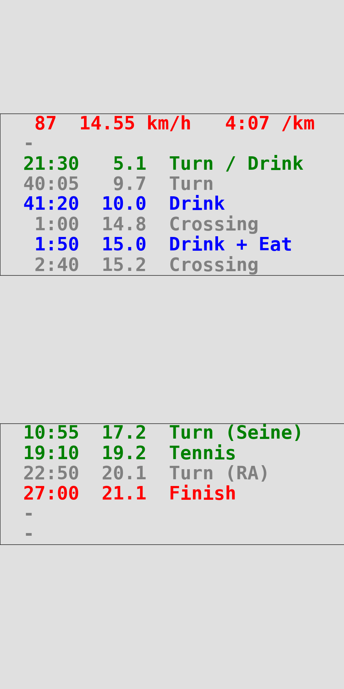
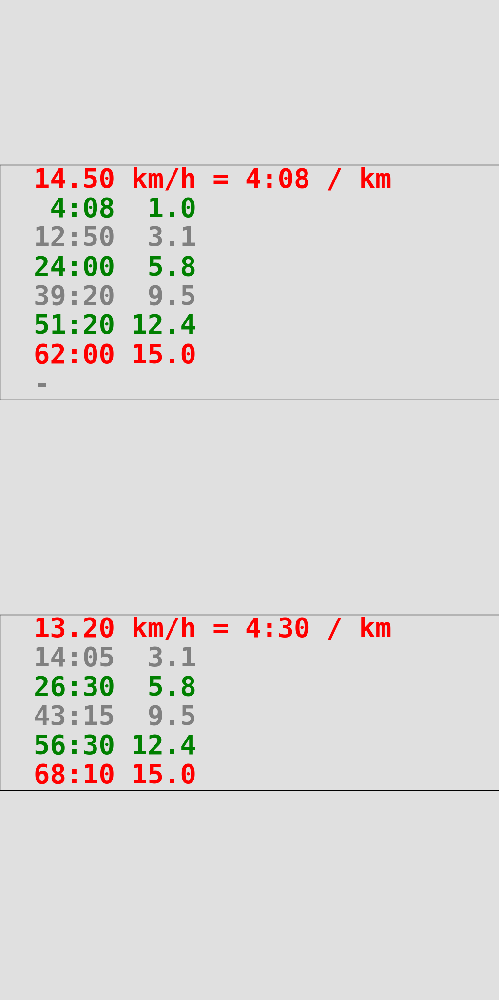

# README.md

```bash
python3 lockscreen/main.py lockscreen/config/race-2022-10-23-Mueggelsee.py
python3 lockscreen/main.py lockscreen/config/race-2022-11-27-Boulogne.py
python3 lockscreen/main.py lockscreen/config/training-Berlin-North-15-km.py
```

**Race-2022-10-23-Mueggelsee**


**Race-2022-11-27-Boulogne**



**Training-Berlin-North-15-km**


