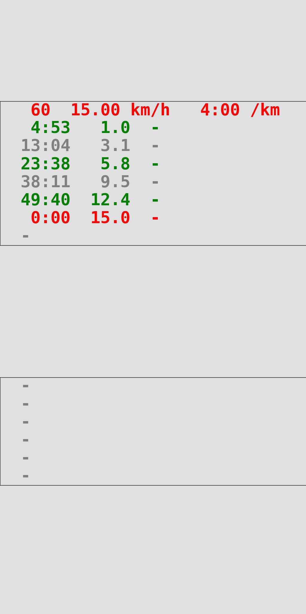

# README.md

## Quickstart

```bash
python3 lockscreen/main.py lockscreen/config/race-2022-10-23-Mueggelsee.py
python3 lockscreen/main.py lockscreen/config/race-2022-11-27-Boulogne.py
python3 lockscreen/main.py lockscreen/config/training-Berlin-North-15-km.py
```

**Race-2022-10-23-Mueggelsee**


**Race-2022-11-27-Boulogne**


**Training-Berlin-North-15-km**



## Constraints and assumptions

* Input: list of checkpoint distances, and a few other parameters
* Output: image to be used as lockscreen, with the time for each checkpoint computed automatically

Constraints:

* Phone (Honor)
    * Height (in lines): top=8, bottom=6
    * Length of lines: 27 char
* Running velocity is assumed constant for each of the 4 sections
* Run times computation:
    * Split (`SPLIT_42_DV = 0.8`):
        * Positive split (running slower), d=0.8 km/h for 42.2 km, scaled for smaller distances
        * Total distance split in 4 sections, assumed constant velocity for each
    * Slow start (`SLOW_START_S = 60`):
        * 1 min due to congestion at the beginning
    * Rounding (`TIME_ROUND_S = 5`):
        * Round all times to 5 sec, to keep them easy to read
