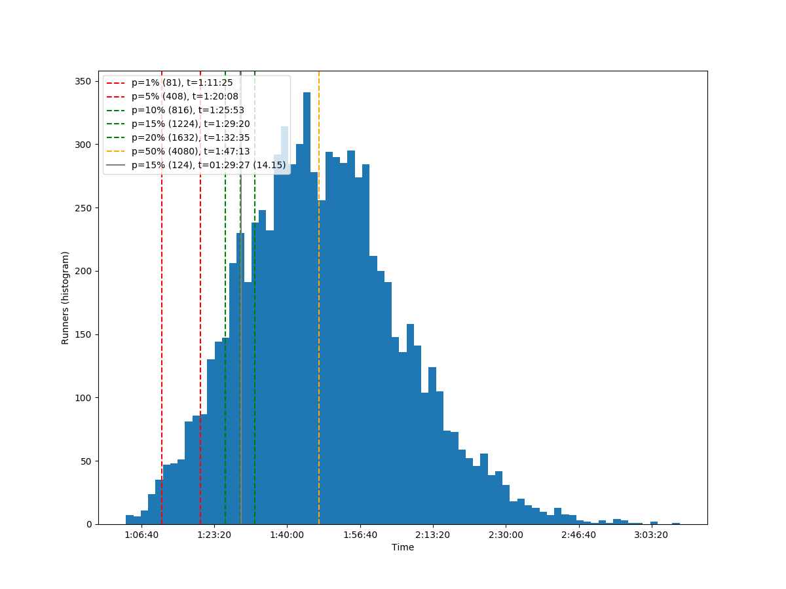
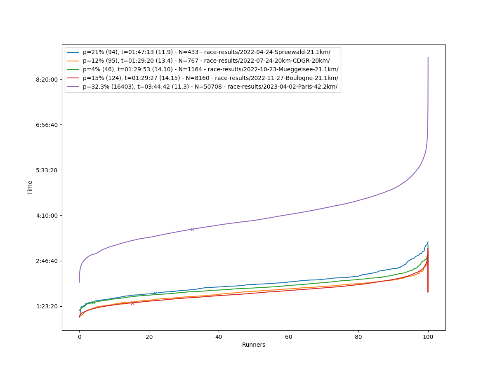

# README.md

## Summary

| Date       | Speed (Time) | Result        | Race            |
|------------|--------------|---------------|-----------------|
| 2022-04-24 | 12.0 (1h45)  | 21% (94/436)  | Spreewald 21.1  |
| 2022-07-24 | 13.5 (1h29)  | 12% (95/767)  | 20 km CDGR 20   |
| 2022-10-23 | 14.1 (1h29)  | 4% (46/1164)  | Mueggelsee 21.1 |
| 2022-11-27 | 14.1 (1h29)  | 15% (1.2k/8.2k) | Boulogne 21.1 |
|            |              |               |                 |
| 2023-04-02 | 14.0 (3h00)  | 5% (1.7k/34k) | Paris 42.2      |
| 2023-04-30 | 14.0 (3h00)  | 2% (5/200)    | Spreewald 42.2  |
| 2023-07-23 | 15.0 (1h20)  | 4% (30/767)   | 20 km CDGR 20   |
| 2023-04-02 | 14.5 (2h50)  | - (-)         | Berlin 42.2     |

## Analysis

Runners performances with various percentiles and my own performance.

```bash
python3 race-results/plot.py race-results/2022-04-24-Spreewald-21.1km/
python3 race-results/plot.py race-results/2022-07-24-20km-CDGR-20km/
python3 race-results/plot.py race-results/2022-10-23-Mueggelsee-21.1km/
python3 race-results/plot.py race-results/2022-11-27-Boulogne-21.1km/

python3 race-results/plot-all.py
```

**2022-04-24 - Spreewald - 21.1 km**


**2022-07-24 - 20 km CDGR - 20 km**


**2022-10-23 - 21.1 km Mueggelsee - 21.1 km**


**2022-11-27 - 21.1 km Boulogne - 21.1 km**




**All**



## Statistics - Participated

### 2022-04-24 - Spreewald - 21.1 km

* Runners: 436

| Percent | Place | Time     | Speed |
|---------|-------|----------|-------|
|       - |     1 | 01:09:32 |  18.2 |
|      1% |     4 | 01:23:27 |  15.2 |
|      5% |    22 | 01:33:24 |  13.6 |
|     10% |    44 | 01:38:31 |  12.9 |
|     15% |    65 | 01:43:16 |  12.3 |
| **21%** | **94** | **01:47:13** | **11.9** |
|     20% |    87 | 01:46:04 |  11.9 |
|     50% |   218 | 02:03:18 |  10.3 |

### 2022-07-24 - 20 km CDGR - 20 km

* Runners: 767

| Percent | Place | Time     | Speed |
|---------|-------|----------|-------|
|       - |     1 | 01:03:55 |  18.8 |
|      1% |     8 | 01:09:13 |  18.4 |
|      5% |    38 | 01:21:45 |  14.7 |
|     10% |    77 | 01:27:21 |  13.8 |
| **12%** | **95** | **01:29:20** | **13.4** |
|     15% |   115 | 01:31:04 |  13.2 |
|     20% |   153 | 01:34:24 |  12.8 |
|     50% |   383 | 01:50:44 |  10.9 |

### 2022-10-23 - 21.1 km Muegelsee - 21.1 km

* Source: https://www.davengo.com/event/result/16-mueggelsee-halbmarathon-2022/search?category=Halbmarathon
* Runners: 1164

| Percent | Place | Time     | Speed |
|---------|-------|----------|-------|
|       - |     1 | 01:15:47 |  16.7 |
|      1% |    12 | 01:21:22 |  15.6 |
| **4%** | **46** | **01:29:53** | **14.10** |
|      5% |    58 | 01:31:29 |  13.8 |
|     10% |   116 | 01:36:35 |  13.1 |
|     15% |   175 | 01:40:48 |  12.6 |
|     20% |   233 | 01:43:35 |  12.2 |
|     50% |   582 | 01:56:51 |  10.8 |

### 2022-11-27 - 21.1 km Boulogne - 21.1 km

* Source: https://www.sport-up.fr/www/resultat/partenaire-20190624003678-Semimarathon-de-BoulogneBillancourt.htm
* Runners: 8160

| Percent | Place | Time     | Speed |
|---------|-------|----------|-------|
|       - |     1 |  1:03:09 |  20.1 |
|      1% |    82 |  1:11:25 |  17.7 |
|      5% |   408 |  1:20:08 |  15.8 |
|     10% |   816 |  1:25:52 |  14.7 |
|     15% |  1224 |  1:29:19 |  14.2 |
| **15%** | **1244** | **01:29:27** | **14.15** |
|     20% |  1632 |  1:32:34 |  13.7 |
|     50% |  4080 |  1:47:13 |  11.8 |

## Statistics - Others

### 2019-07 - 20 km CDGR

* Source: https://web.archive.org/web/20210729114249/https://www.20kmcotegranitrose.com/palmares-2019/
* Runners: 1 068

| Percent | Place | Time     |
|---------|-------|----------|
|       - |     1 | 01:06:37 |
|      1% |    10 | 01:13:00 |
|      5% |    53 | 01:25:12 |
|     10% |   107 | 01:28:46 |
|     15% |   160 | 01:32:34 |
|     20% |   213 | 01:35:17 |
|     50% |   534 | 01:48:25 |

### 2019-07 - 21.1 km Boulogne

* Runners: 8 114

| Percent | Place | Time 21.1 km | Time 10 km |
|---------|-------|--------------|------------|
|       - |     1 |      1:00:12 |    0:29:10 |
|      1% |    81 |      1:13:59 |    0:34:48 |
|      5% |   406 |      1:22:35 |    0:38:59 |
|     10% |   811 |      1:27:51 |    0:41:27 |
|     15% |  1217 |      1:31:25 |    0:42:48 |
|     20% |  1623 |      1:34:10 |    0:43:42 |
|     50% |  4057 |      1:48:14 |    0:51:15 |

### 2021-10 - 21.1 Muegelsee

* Source: https://www.davengo.com/event/result/15-mueggelsee-halbmarathon-2021/
* Runners: 994

| Percent | Place | Time 21.1 km |
|---------|-------|--------------|
|       - |     1 |      1:15:32 |
|      1% |    10 |      1:19:11 |
|      5% |    50 |      1:28:40 |
|     10% |    94 |      1:33:32 |
|     15% |   149 |      1:36:52 |
|     20% |   199 |      1:40:51 |
|     50% |   497 |      1:54:50 |

### 2022 - 42 km Paris

* Source: https://resultscui.active.com/api/results/events/SchneiderElectricMarathondeParis2022/participants?groupId=947610&routeId=170632&offset=0&limit=100
* Runners: 34 365

| Percent | Place | Speed | Time |
|---------|-------|-------|------|
|       - |    1  |  20.2 | 2:05 |
|      1% |  344  |  15.4 | 2:44 |
|      5% | 1718  |  14.0 | 3:00 |
|     10% | 3437  |  13.0 | 3:14 |
|     15% | 5155  |  12.4 | 3:24 |
|     20% | 6873  |  12.0 | 3:30 |
|     50% | 17183 |  10.5 | 4:01 |

### 2022-04-24 - Spreewald - 42.2 km

* Runners: 207
* André

| Percent | Place | Time     | Speed |
|---------|-------|----------|-------|
|       - |     1 | 02:54:28 |  14.5 |
|      1% |     2 | 03:00:14 |  14.1 |
|      5% |    10 | 03:19:11 |  12.7 |
|     10% |    21 | 03:29:32 |  12.1 |
|     15% |    31 | 03:39:13 |  11.6 |
|     20% |    41 | 03:47:26 |  11.1 |
| **24%** | **50** | **03:50:05** | **11.0** |
|     50% |   103 | 04:16:25 |   9.9 |
