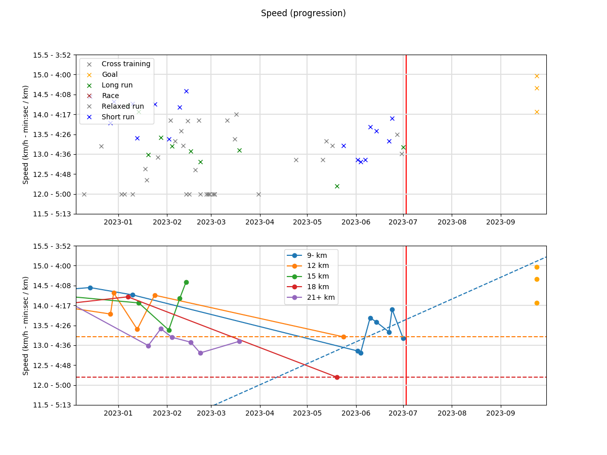

# README.md

```bash
python3 training-analysis/main.py
```

**Distance and milage**

1. All trainings and races distances
2. Distances by week and by month


**Speed (progression)**

1. All trainings and races speeds
2. Speeds by distance, with a linear regression



**Speed (monthly average)**


**Predicted marathon and half-marathon times**


**Predicted distance (km) at 14.1 km/h**


**Stdout**

```
== Milage (yearly) ==
2020-01-01:  6 runs -   32 km /  3.0 h - a_avg/run:  5.5 km, 10.89 km/h - f_predicted_med: 10.86/10.42 km/h
2021-01-01: 27 runs -  223 km / 19.4 h - a_avg/run:  8.3 km, 11.55 km/h - f_predicted_med: 11.92/11.44 km/h
2022-01-01: 87 runs - 1133 km / 85.8 h - a_avg/run: 13.0 km, 13.28 km/h - f_predicted_med: 14.09/13.51 km/h

== Milage (monthly) ==
2022-01-01:  2 runs -   15 km /  1.4 h - a_avg/run:  7.8 km, 11.14 km/h - f_predicted_med: 10.50/10.07 km/h
2022-02-01:  3 runs -   23 km /  1.9 h - a_avg/run:  7.7 km, 12.37 km/h - f_predicted_med: 11.85/11.36 km/h
2022-03-01:  5 runs -   53 km /  4.5 h - a_avg/run: 10.7 km, 12.13 km/h - f_predicted_med: 11.60/11.13 km/h
2022-04-01:  9 runs -  119 km /  9.8 h - a_avg/run: 13.3 km, 12.31 km/h - f_predicted_med: 12.27/11.77 km/h
2022-05-01:  8 runs -  101 km /  8.2 h - a_avg/run: 12.7 km, 12.70 km/h - f_predicted_med: 12.83/12.30 km/h
2022-06-01:  9 runs -  113 km /  8.8 h - a_avg/run: 12.6 km, 13.17 km/h - f_predicted_med: 13.33/12.78 km/h
2022-07-01: 12 runs -  149 km / 10.9 h - a_avg/run: 12.4 km, 13.72 km/h - f_predicted_med: 13.62/13.07 km/h
2022-08-01: 12 runs -  163 km / 11.9 h - a_avg/run: 13.6 km, 13.80 km/h - f_predicted_med: 13.65/13.09 km/h
2022-09-01: 10 runs -  163 km / 11.9 h - a_avg/run: 16.3 km, 13.82 km/h - f_predicted_med: 13.93/13.36 km/h
2022-10-01:  9 runs -  135 km /  9.7 h - a_avg/run: 15.0 km, 13.86 km/h - f_predicted_med: 14.09/13.51 km/h
2022-11-01:  8 runs -   95 km /  6.8 h - a_avg/run: 11.9 km, 13.93 km/h - f_predicted_med: 13.83/13.26 km/h

== Milage (weekly) ==
2022-01-03:  1 runs -    7 km /  0.7 h - a_avg/run:  7.8 km, 11.14 km/h - f_predicted_med: 10.50/10.07 km/h
2022-01-10:  1 runs -    0 km /  0.0 h - a_avg/run:  0.0 km,  0.00 km/h - f_predicted_med:  0.00/ 0.00 km/h
2022-01-17:  1 runs -    0 km /  0.0 h - a_avg/run:  0.0 km,  0.00 km/h - f_predicted_med:  0.00/ 0.00 km/h
2022-01-24:  1 runs -    0 km /  0.0 h - a_avg/run:  0.0 km,  0.00 km/h - f_predicted_med:  0.00/ 0.00 km/h
2022-01-31:  1 runs -    0 km /  0.0 h - a_avg/run:  0.0 km,  0.00 km/h - f_predicted_med:  0.00/ 0.00 km/h
2022-02-07:  1 runs -    6 km /  0.5 h - a_avg/run:  6.0 km, 12.00 km/h - f_predicted_med: 11.13/10.67 km/h
2022-02-14:  1 runs -    5 km /  0.5 h - a_avg/run:  5.8 km, 12.89 km/h - f_predicted_med: 11.93/11.44 km/h
2022-02-21:  1 runs -   11 km /  0.9 h - a_avg/run: 11.2 km, 12.22 km/h - f_predicted_med: 11.76/11.28 km/h
2022-02-28:  1 runs -    0 km /  0.0 h - a_avg/run:  0.0 km,  0.00 km/h - f_predicted_med:  0.00/ 0.00 km/h
2022-03-07:  2 runs -   24 km /  2.0 h - a_avg/run: 12.0 km, 12.00 km/h - f_predicted_med: 11.60/11.13 km/h
2022-03-14:  1 runs -   12 km /  1.0 h - a_avg/run: 12.0 km, 12.00 km/h - f_predicted_med: 11.60/11.13 km/h
2022-03-21:  1 runs -   12 km /  1.0 h - a_avg/run: 12.0 km, 12.00 km/h - f_predicted_med: 11.60/11.13 km/h
2022-03-28:  1 runs -    5 km /  0.5 h - a_avg/run:  5.7 km, 12.67 km/h - f_predicted_med: 11.71/11.23 km/h
2022-04-04:  2 runs -   30 km /  2.5 h - a_avg/run: 15.1 km, 12.08 km/h - f_predicted_med: 11.84/11.36 km/h
2022-04-11:  2 runs -   25 km /  2.1 h - a_avg/run: 12.8 km, 12.08 km/h - f_predicted_med: 11.66/11.18 km/h
2022-04-18:  2 runs -   33 km /  2.7 h - a_avg/run: 16.5 km, 12.16 km/h - f_predicted_med: 11.95/11.46 km/h
2022-04-25:  3 runs -   30 km /  2.4 h - a_avg/run: 10.2 km, 12.70 km/h - f_predicted_med: 12.32/11.82 km/h
2022-05-02:  2 runs -   31 km /  2.5 h - a_avg/run: 15.7 km, 12.72 km/h - f_predicted_med: 12.42/11.91 km/h
2022-05-09:  2 runs -   19 km /  1.5 h - a_avg/run:  9.7 km, 12.58 km/h - f_predicted_med: 12.00/11.51 km/h
2022-05-16:  2 runs -   27 km /  2.2 h - a_avg/run: 13.6 km, 12.62 km/h - f_predicted_med: 12.29/11.79 km/h
2022-05-23:  1 runs -   18 km /  1.5 h - a_avg/run: 18.0 km, 11.87 km/h - f_predicted_med: 11.76/11.28 km/h
2022-05-30:  3 runs -   33 km /  2.6 h - a_avg/run: 11.0 km, 12.97 km/h - f_predicted_med: 12.63/12.12 km/h
2022-06-06:  1 runs -   11 km /  0.9 h - a_avg/run: 11.7 km, 13.50 km/h - f_predicted_med: 13.03/12.50 km/h
2022-06-13:  3 runs -   33 km /  2.5 h - a_avg/run: 11.0 km, 13.43 km/h - f_predicted_med: 13.13/12.59 km/h
2022-06-20:  2 runs -   30 km /  2.4 h - a_avg/run: 15.0 km, 12.82 km/h - f_predicted_med: 12.54/12.03 km/h
2022-06-27:  3 runs -   42 km /  3.1 h - a_avg/run: 14.0 km, 13.69 km/h - f_predicted_med: 13.41/12.87 km/h
2022-07-04:  3 runs -   39 km /  2.8 h - a_avg/run: 13.0 km, 13.95 km/h - f_predicted_med: 13.69/13.13 km/h
2022-07-11:  2 runs -   27 km /  2.0 h - a_avg/run: 13.5 km, 13.14 km/h - f_predicted_med: 12.75/12.23 km/h
2022-07-18:  3 runs -   38 km /  2.8 h - a_avg/run: 12.7 km, 13.64 km/h - f_predicted_med: 13.26/12.72 km/h
2022-07-25:  2 runs -   15 km /  1.0 h - a_avg/run:  7.5 km, 14.28 km/h - f_predicted_med: 13.41/12.86 km/h
2022-08-01:  2 runs -   25 km /  1.8 h - a_avg/run: 12.8 km, 13.91 km/h - f_predicted_med: 13.49/12.95 km/h
2022-08-08:  3 runs -   39 km /  2.9 h - a_avg/run: 13.0 km, 13.57 km/h - f_predicted_med: 13.18/12.65 km/h
2022-08-15:  3 runs -   33 km /  2.4 h - a_avg/run: 11.0 km, 14.12 km/h - f_predicted_med: 13.55/13.00 km/h
2022-08-22:  3 runs -   51 km /  3.8 h - a_avg/run: 17.0 km, 13.62 km/h - f_predicted_med: 13.51/12.96 km/h
2022-08-29:  2 runs -   30 km /  2.2 h - a_avg/run: 15.0 km, 13.56 km/h - f_predicted_med: 13.29/12.75 km/h
2022-09-05:  3 runs -   55 km /  4.1 h - a_avg/run: 18.3 km, 13.56 km/h - f_predicted_med: 13.62/13.07 km/h
2022-09-12:  3 runs -   54 km /  3.9 h - a_avg/run: 18.0 km, 13.86 km/h - f_predicted_med: 13.81/13.25 km/h
2022-09-19:  3 runs -   39 km /  2.8 h - a_avg/run: 13.0 km, 14.23 km/h - f_predicted_med: 13.86/13.30 km/h
2022-09-26:  1 runs -    0 km /  0.0 h - a_avg/run:  0.0 km,  0.00 km/h - f_predicted_med:  0.00/ 0.00 km/h
2022-10-03:  3 runs -   51 km /  3.6 h - a_avg/run: 17.0 km, 14.04 km/h - f_predicted_med: 14.07/13.50 km/h
2022-10-10:  2 runs -   30 km /  2.2 h - a_avg/run: 15.0 km, 13.75 km/h - f_predicted_med: 13.47/12.92 km/h
2022-10-17:  2 runs -   36 km /  2.6 h - a_avg/run: 18.1 km, 13.94 km/h - f_predicted_med: 13.80/13.23 km/h
2022-10-24:  2 runs -   18 km /  1.3 h - a_avg/run:  9.0 km, 13.63 km/h - f_predicted_med: 12.91/12.38 km/h
2022-10-31:  2 runs -   30 km /  2.1 h - a_avg/run: 15.0 km, 14.09 km/h - f_predicted_med: 13.80/13.24 km/h
2022-11-07:  3 runs -   30 km /  2.1 h - a_avg/run: 10.1 km, 14.34 km/h - f_predicted_med: 13.71/13.15 km/h
2022-11-14:  1 runs -   15 km /  1.1 h - a_avg/run: 15.0 km, 14.29 km/h - f_predicted_med: 14.00/13.43 km/h
2022-11-21:  2 runs -   20 km /  1.5 h - a_avg/run: 10.0 km, 12.99 km/h - f_predicted_med: 12.42/11.91 km/h

== Progress ==

(f(month) = km/h/month ; by distance)

        |    12     9     6     3     2     1
--------+-------+-----+-----+-----+-----+-----+
  9- km |   0.31  0.25  0.19 -0.17 -4.47 -4.47
  12 km |   0.33  0.34  0.06 -0.08  0.00  0.00
  15 km |   0.34  0.34  0.30  0.23 -0.17  0.51
  18 km |   0.40  0.40  1.22  0.00  0.00  0.00
 21+ km |   0.29  0.29  0.25  0.60  0.35  0.00
```
